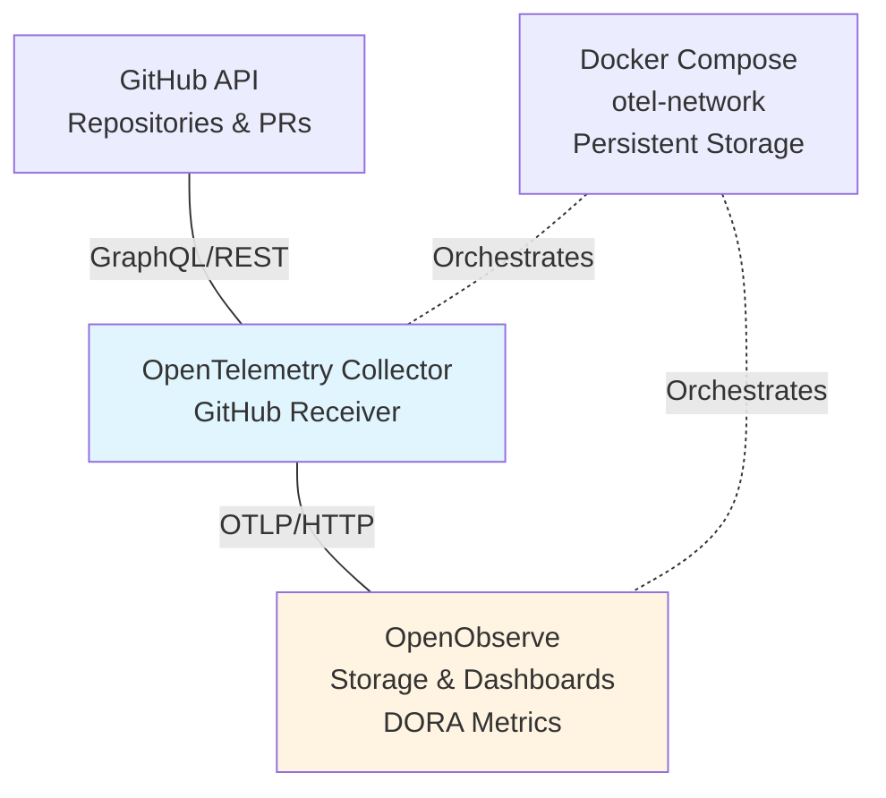

# Deployment Architecture - DORA Metrics Collection System

```mermaid
graph TD
    GitHub[GitHub API<br/>Repositories & PRs]

    OTel[OpenTelemetry Collector<br/>GitHub Receiver<br/>]

    OpenObserve[OpenObserve<br/>Storage & Dashboards<br/>DORA Metrics]

    Docker[Docker Compose<br/>otel-network<br/>Persistent Storage]

    GitHub ---|GraphQL/REST| OTel
    OTel ---|OTLP/HTTP| OpenObserve
    Docker -.-|Orchestrates| OTel
    Docker -.-|Orchestrates| OpenObserve

    style OTel fill:#e1f5ff
    style OpenObserve fill:#fff4e1
```