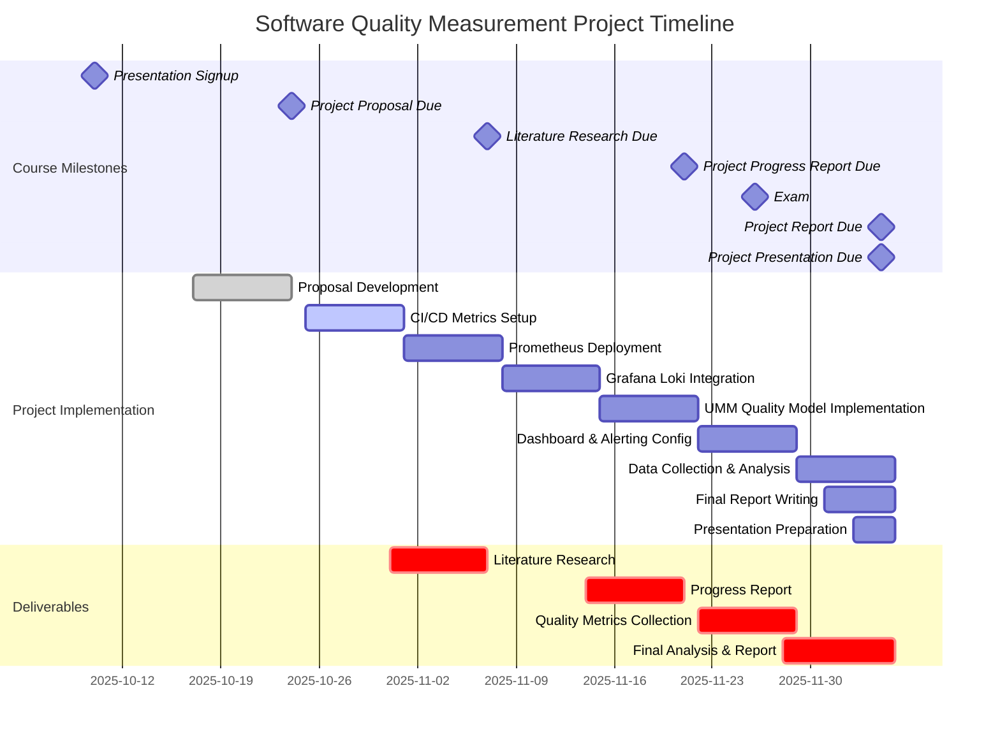
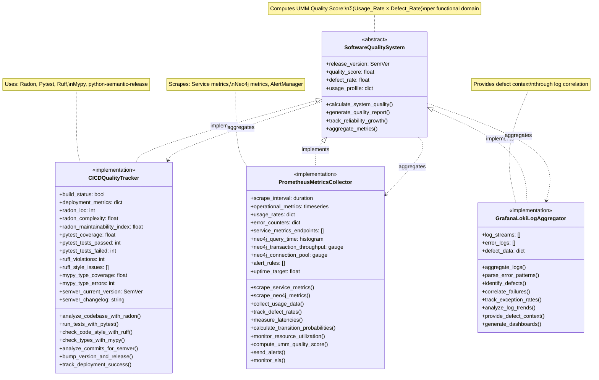
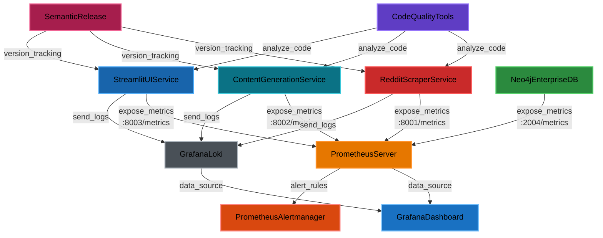

# Project Title
**Operational Profile-Based Software Quality Measurement for LinkedIn Content Curation Platform**

# Abstract

This project implements a comprehensive software quality measurement system for a microservices-based LinkedIn content curation platform. The system combines static code analysis (CI/CD metrics) with runtime operational metrics (Prometheus) and log-based defect tracking (Grafana Loki) to provide quantifiable quality assessment. Following Jeff Tian's Unified Markov Model (UMM) methodology, quality is characterized by computing usage-weighted defect rates across functional domains (Reddit scraping, content generation, and user interface services). The measurement system tracks code quality metrics (LOC, complexity, test coverage, linting violations, type coverage) via CI/CD pipelines, operational metrics (API latency, error rates, throughput, resource utilization) via Prometheus, and defect context via Grafana Loki log aggregation. System-wide quality score is calculated as Σ(Usage_Probability × Defect_Rate) per functional domain, enabling prioritization of quality improvements in high-usage components. The project delivers actionable quality insights through automated dashboards, configurable alerts, and reliability growth tracking across semantic-versioned releases.

# Project Schedule



# Overview

Code quality metrics will be captured in CI/CD workflows using python quality-checking plugins: *Ruff, Mypy, Pytest, Radon, etc*.

Operational quality metrics will be capturing using a combination of *Prometheus* and *Grafana Loki*.

# Functional Domain Mapping

The system will be organized into three core functional domains, each with specific code quality and operational metrics. This breakdown can be used to construct an operational profile-based quality model following Jeff Tian's Unified Markov Model (UMM) approach. Each domain's Defect Rate and Usage Rates can be tracked by Prometheus for usage tracking, and Prometheus, Grafana Loki, and CI/CD for Defect Rates.

## Operational Profile-Based Quality Model (Tian's UMM)

Following Tian's methodology, system quality will be characterized by combining operational profiles (usage patterns) with defect rates across functional domains:

**Quality Metric Formula:**
```
System Quality Score = Σ (Usage_Probability(state) × Defect_Rate(state))
```

Where:
- **Usage_Probability(state)**: Proportion of total operations occurring in each functional domain (from Prometheus usage metrics)
- **Defect_Rate(state)**: Failures per 1000 operations in each functional domain (from error counters and logs)

**Operational States (Functional Domains):**
1. **Reddit Scraping** - Data ingestion from external API
2. **Content Generation** - LLM-based content transformation
3. **User Interface** - Human review and interaction
4. **Database Operations** - Neo4j graph queries and persistence

**Transition Model:**
```
User Request → Reddit Scraping → Database Write → Content Generation → Database Read → UI Display → Human Review → (Approve/Reject)
```

**Metrics Collection for UMM:**
- **Usage Tracking**: Prometheus counters track operation frequency per domain
- **Defect Tracking**: Error rates, failed operations, and exceptions per domain
- **Transition Probabilities**: Derived from API endpoint call patterns and service-to-service communication metrics
- **Reliability Calculation**: System reliability = Π (1 - Defect_Rate(state))^Usage_Count(state)

## Service Breakdown with UMM Quality Metrics

Service | Code Quality Metrics | Operational Metrics | UMM Quality Metrics
--------|---------------------|---------------------|--------------------
Reddit Scraper Service | LOC, Cyclomatic Complexity, Test Coverage, Maintainability Index, Linting Violations, Type Coverage | Reddit API Latency, Error Rates, Scrape Success Rate, Posts Processed/Hour, API Rate Limit Usage | **Usage Rate**: Posts/Hour, **Defect Rate**: Scrape Failures / Total Scrapes
Content Generation Service | LOC, Cyclomatic Complexity, Test Coverage, Maintainability Index, Linting Violations, Type Coverage | LLM API Latency, Token Usage, Generation Success Rate, Cost per Generation, Content Approval Rate | **Usage Rate**: Generations/Hour, **Defect Rate**: (Failed + Rejected) / Total Generations
Streamlit UI Service | LOC, Cyclomatic Complexity, Test Coverage, Maintainability Index, Linting Violations, Type Coverage | User Sessions, Response Time, Page Load Time, User Actions/Session, Error Rate | **Usage Rate**: Sessions/Hour, **Defect Rate**: UI Errors / Total User Actions

**Transition Probabilities (measured via Prometheus):**
- P(Scrape → Content Generation) = Content Generations / Successful Scrapes
- P(Content Generation → UI Review) = UI Review Sessions / Generated Content
- P(UI Review → Approval) = Approved Content / Total Reviews
- P(UI Review → Rejection) = Rejected Content / Total Reviews

# Operational Metrics

Operational and Usage metrics will be tracked by release and separated by functional domain. This usage information will be used to calculate:
1. **Failure rate** per functional domain (defect density)
2. **Mean Time To Failure (MTTF)** per functional domain
3. **Usage-weighted system quality** following Tian's UMM approach
4. **Transition reliability** between operational states

**Per-Domain Quality Calculation:**
- **Domain Quality Score** = (Successful Operations / Total Operations) per time period
- **System-Wide Quality Score** = Σ (Usage_Weight × Domain_Quality) across all domains
- **Reliability Growth** = Track quality score improvements across releases
-   Performance metrics (response time, throughput, resource utilization) from Prometheus
-   API endpoint usage and error rates from Prometheus
-   Application-specific metrics (user sessions, external API latency, cache hit rates) from Prometheus
-   Database performance metrics (Neo4j Enterprise query time, transaction throughput, connection pool usage) from Neo4j built-in Prometheus endpoint
-   Log data and defect data from Grafana Loki
-   Uptime and availability monitoring from Prometheus Alertmanager


# Metrics Stack Architecture

## Quality Tracking System Architecture



## Component Relationships



# Summary

## CI/CD Metrics

The following metrics will be implemented in CI/CD jobs.

### Code Quality
- Test Coverage: **Pytest**
- Lines of Code (LOC): **Radon**
- Cyclomatic Complexity: **Radon**
- Maintainability Index: **Radon**

### Code Style & Consistency
- Linting Violations: **Ruff**
- Type Hint Coverage: **Mypy**
- Code Duplication: **Ruff**

### Semantic Versioning
- Version Tracking: **python-semantic-release**
- Changelog Generation: **python-semantic-release**
- Git Tag Creation: **python-semantic-release**
- Deployment Success Rate: **CI/CD Pipeline**

## Operational Metrics

Prometheus will be deployed as a microservice to track the following metrics for the Streamlit App, Reddit Scrapper Service, and Neo4j Database

### Reddit Scrapper Service Metrics

- Reddit API Latency: **Prometheus** (histogram)
- Scrape Error Rate: **Prometheus** (counter)
- Scrape Success Rate: **Prometheus** (gauge)
- Posts Processed Per Hour: **Prometheus** (counter)
- API Rate Limit Usage: **Prometheus** (gauge)
- Service Uptime: **Prometheus** (gauge)


### Content Generation Service Metrics

- LLM API Latency: **Prometheus** (histogram)
- Token Usage Total: **Prometheus** (counter)
- Generation Success Rate: **Prometheus** (gauge)
- Cost Per Generation: **Prometheus** (gauge)
- Content Approval Rate: **Prometheus** (gauge)
- Service Uptime: **Prometheus** (gauge)


### Streamlit UI Service Metrics

- User Sessions Active: **Prometheus/Custom Middleware** (gauge)
- Response Time: **Prometheus** (histogram)
- Page Load Time: **Prometheus** (histogram)
- User Actions Per Session: **Prometheus** (counter)
- UI Error Rate: **Prometheus** (counter)
- Service Uptime: **Prometheus** (gauge)


### Neo4j Enterprise Database Metrics

Neo4j Enterprise is deployed as a containerized service with built-in Prometheus metrics endpoint enabled via:
- `server.metrics.prometheus.enabled=true`
- `server.metrics.prometheus.endpoint=0.0.0.0:2004`


- Query Execution Time (P50, P95, P99): **Neo4j Prometheus Endpoint** (histogram)
- Transaction Throughput: **Neo4j Prometheus Endpoint** (gauge)
- Connection Pool Utilization: **Neo4j Prometheus Endpoint** (gauge)
- Cypher Query Performance: **Neo4j Prometheus Endpoint** (histogram)
- Graph Traversal Depth: **Neo4j Prometheus Endpoint** (histogram)
- Database Storage Usage: **Neo4j Prometheus Endpoint** (gauge)
- Node/Relationship Counts: **Neo4j Prometheus Endpoint** (gauge)
- Page Cache Hit Ratio: **Neo4j Prometheus Endpoint** (gauge)
- GC Pause Time (JVM): **Neo4j Prometheus Endpoint** (histogram)
- Container Health Status: **Container Metrics** (gauge)

## Infrastructure & Monitoring Metrics

The Prometheus service and Grafana Loki will passively monitor system performance and capture the following metrics about the kubernetes cluster.

### Performance & Reliability
- Response Time (P50, P95, P99): **Prometheus**
- Throughput (Requests/sec): **Prometheus**
- Error Rates by Endpoint: **Prometheus**
- Resource Utilization (CPU, Memory, Disk I/O): **Prometheus**
- Uptime/Availability: **Prometheus Alertmanager**

### Application-Specific
- API Endpoint Usage: **Prometheus**
- External API Latency (Reddit, LangChain/Gemini): **Prometheus**
- Cache Hit Rates: **Prometheus**
- Queue Depths: **Prometheus**

### Logging & Monitoring
- Log Data: **Grafana Loki**
- Defect/Error Data: **Grafana**

# Follow-up Actions & Process Improvement

This section defines the response protocols and continuous improvement processes triggered by quality metrics thresholds and trend analysis.

## Quality Thresholds & Alert Triggers

### CI/CD Quality Gates

**Blocking Conditions (Prevent Merge/Deploy):**
- Test Coverage < 70% (per service)
- Cyclomatic Complexity > 15 (any function)
- Maintainability Index < 50 (any module)
- Linting Violations > 50 (per service)
- Type Coverage < 60% (per service)
- Failed Tests > 0

**Warning Conditions (Allow Merge with Review):**
- Test Coverage 70-80%
- Cyclomatic Complexity 10-15
- Maintainability Index 50-65
- Linting Violations 20-50

**Actions:**
1. **Automated**: CI/CD pipeline blocks merge request
2. **Notification**: Alert developer via GitHub PR comment with specific violations
3. **Required Action**: Developer must refactor code or justify exception
4. **Review**: Team lead approval required for threshold exceptions

### Operational Quality Alerts

**Critical Alerts (Immediate Response Required):**
- Error Rate > 5% (any service)
- API Response Time P95 > 2000ms
- Service Uptime < 99%
- Database Connection Pool Utilization > 90%
- Neo4j Query Time P95 > 500ms
- System-Wide UMM Quality Score > 0.05 (5% defect rate)

**Warning Alerts (Investigation Within 24 Hours):**
- Error Rate 1-5%
- API Response Time P95 1000-2000ms
- Service Uptime 99-99.9%
- Database Connection Pool Utilization 75-90%
- UMM Quality Score 0.02-0.05 (2-5% defect rate)

**Actions:**
1. **Automated**: Prometheus Alertmanager sends notifications to on-call engineer
2. **Triage**: Review Grafana dashboards and Loki logs to identify root cause
3. **Mitigation**: Apply immediate fixes (scale resources, rollback deployment, disable feature)
4. **Documentation**: Create incident report in issue tracker
5. **Post-mortem**: Conduct root cause analysis within 48 hours

## UMM Quality Score Response Plan

The UMM quality score (Σ(Usage_Probability × Defect_Rate)) provides usage-weighted quality assessment. When quality degrades, follow this prioritization framework:

### Quality Score Degradation Triggers

**Severity Levels:**
- **Critical**: UMM Score increases by >50% between releases
- **Major**: UMM Score increases by 25-50% between releases
- **Minor**: UMM Score increases by 10-25% between releases
- **Informational**: UMM Score increases by <10% between releases

### Prioritized Response Strategy

**Step 1: Identify High-Impact Domains**
```
Impact Score = Usage_Probability × Defect_Rate × 1000
```

Prioritize domains with highest Impact Score:
- Focus on services with >30% usage probability first
- Example: If Reddit Scraper has 60% usage and 3% defect rate:
  Impact = 0.60 × 0.03 × 1000 = 18 points

**Step 2: Domain-Specific Actions**

**Reddit Scraper Service:**
- **Defect Types**: API failures, rate limiting, parsing errors
- **Actions**:
  - Implement exponential backoff for API retries
  - Add request caching to reduce API calls
  - Improve error handling for malformed posts
  - Add integration tests for edge cases

**Content Generation Service:**
- **Defect Types**: LLM timeouts, token limit exceeded, poor quality output
- **Actions**:
  - Implement timeout handling with fallback strategies
  - Add content validation before returning results
  - Track rejection reasons to improve prompts
  - Implement content quality scoring

**Streamlit UI Service:**
- **Defect Types**: Session errors, rendering failures, slow page loads
- **Actions**:
  - Optimize database queries
  - Implement caching for frequently accessed data
  - Add client-side validation
  - Improve error messages for user clarity

**Neo4j Database:**
- **Defect Types**: Slow queries, connection timeouts, transaction failures
- **Actions**:
  - Add missing indexes on frequently queried properties
  - Optimize Cypher queries with EXPLAIN/PROFILE
  - Increase connection pool size
  - Implement query result caching

**Step 3: Measure Improvement**
- Re-calculate UMM quality score after fixes deployed
- Track reliability growth: `(New_Quality_Score - Old_Quality_Score) / Old_Quality_Score × 100%`
- Target: Reduce defect rate by 20% per iteration

## Reliability Growth Tracking

**Per-Release Metrics:**
- Defect Rate (per 1000 operations) by functional domain
- System-Wide UMM Quality Score
- Transition Reliability between operational states
- MTTF (Mean Time To Failure) per service

**Continuous Improvement Actions:**
1. **Monthly Quality Review Meeting**
   - Review UMM quality score trends
   - Identify services with increasing defect rates
   - Allocate engineering resources to highest-impact improvements

2. **Quarterly Quality Retrospective**
   - Analyze correlation between code metrics (complexity, coverage) and operational defects
   - Update quality thresholds based on historical data
   - Refine UMM model with actual usage patterns

3. **Automated Regression Detection**
   - Alert when any domain's defect rate increases >2× baseline
   - Automatically create issue tickets with relevant metrics
   - Tag releases with quality score for easy rollback identification

## Process Improvement Cycle

**Weekly:**
- Review critical/warning alerts from previous week
- Update alert thresholds based on false positive rate
- Document recurring issues and patterns

**Sprint-based (Bi-weekly):**
- Include quality debt stories in sprint planning
- Prioritize technical debt based on UMM impact scores
- Allocate 20% of sprint capacity to quality improvements

**Per-Release:**
- Generate quality report comparing current vs previous release
- Update operational profile (usage probabilities) based on actual data
- Recalibrate defect rate baselines

**Quarterly:**
- Conduct comprehensive quality assessment
- Update quality strategy based on lessons learned
- Refine measurement tools and dashboards

## Escalation Path

**Level 1: Developer** (All warnings, automated CI/CD failures)
- Fix code quality issues before merge
- Investigate operational warnings within 24 hours

**Level 2: Team Lead** (Repeated violations, quality gate exceptions)
- Approve quality threshold exceptions with justification
- Review recurring defect patterns
- Allocate resources for quality improvements

**Level 3: Engineering Manager** (Critical alerts, >20% quality degradation)
- Make go/no-go decisions on releases
- Authorize emergency fixes and hotfixes
- Coordinate cross-team quality initiatives

**Level 4: VP Engineering** (System-wide outages, UMM score >10%)
- Declare quality emergency
- Halt feature development for stabilization
- Approve major architecture changes

## Success Metrics for Follow-up Actions

**Effectiveness Indicators:**
- Time to Resolution: Alert trigger → Issue resolved (Target: <2 hours for critical)
- Recurrence Rate: Same defect type reappearing (Target: <5%)
- Quality Score Improvement: Release-over-release improvement (Target: -10% defect rate)
- Alert Accuracy: True positive alerts / Total alerts (Target: >80%)
- Coverage of Root Causes: Issues with identified root cause (Target: >90%)
