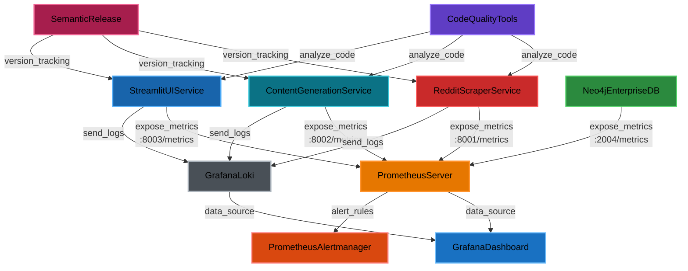

## Overview

Each release of the system will be tracked using Semantic Versioning (SemVer) format: MAJOR.MINOR.PATCH (e.g., 1.2.3), where:
-   MAJOR version increments for incompatible API changes
-   MINOR version increments for backward-compatible functionality additions
-   PATCH version increments for backward-compatible bug fixes

Releases will be automatically indexed and tagged using semantic-release or python-semantic-release, which analyzes commit messages to determine version bumps and generate changelogs. The following code quality metrics will be tracked on a per-release schedule using CI/CD pipelines, and will be labeled with each functional domain of the system that they support.
-   Radon to measure Lines of Code (LOC), Cyclomatic Complexity, and Maintainability Index.
-   Pytest to measure test coverage.
-   Ruff to measure linting violations and style guide adherence.
-   Mypy to measure type hint coverage.
-   Pylint to detect code duplication and code smells.
-   Interrogate to measure docstring coverage.

## Release Automation

Semantic versioning will be automated using python-semantic-release, which:
-   Analyzes commit messages following Conventional Commits specification
-   Automatically determines the next version number
-   Generates changelogs from commit history
-   Creates git tags and GitHub releases
-   Updates version in pyproject.toml

Commit message format for automatic versioning:
-   `feat:` triggers MINOR version bump
-   `fix:` triggers PATCH version bump
-   `BREAKING CHANGE:` or `feat!:` / `fix!:` triggers MAJOR version bump

## Functional Domain Mapping

The system is organized into three core functional domains, each with specific code quality and operational metrics:

### Service Breakdown

Service | Code Quality Metrics | Operational Metrics
--------|---------------------|---------------------
Reddit Scraper Service | LOC, Cyclomatic Complexity, Test Coverage, Maintainability Index, Linting Violations, Type Coverage | Reddit API Latency, Error Rates, Scrape Success Rate, Posts Processed/Hour, API Rate Limit Usage
Content Generation Service | LOC, Cyclomatic Complexity, Test Coverage, Maintainability Index, Linting Violations, Type Coverage | LLM API Latency, Token Usage, Generation Success Rate, Cost per Generation, Content Approval Rate
Streamlit UI Service | LOC, Cyclomatic Complexity, Test Coverage, Maintainability Index, Linting Violations, Type Coverage | User Sessions, Response Time, Page Load Time, User Actions/Session, Error Rate

## Operational Metrics

Operational and Usage metrics will be tracked by release and seperated by functional domain. This usage information will be used to calculate failure rate and Mean Time To Failure (MTTR) per functional domain.
-   Performance metrics (response time, throughput, resource utilization) from Prometheus
-   API endpoint usage and error rates from Prometheus
-   Application-specific metrics (user sessions, external API latency, cache hit rates) from Prometheus
-   Database performance metrics (Neo4j Enterprise query time, transaction throughput, connection pool usage) from Neo4j built-in Prometheus endpoint
-   Log data and defect data from Grafana Loki
-   Uptime and availability monitoring from Prometheus Alertmanager

## Metrics Stack Architecture

### Component Relationships

## Summary

### Code Quality Metrics

Metric | Tool
-------|-----
Test Coverage | Pytest
Lines of Code (LOC) | Radon
Cyclomatic Complexity | Radon
Maintainability Index | Radon

### Code Style & Consistency

Metric | Tool
-------|-----
Linting Violations | Ruff
Type Hint Coverage | Mypy
Code Duplication | Pylint

### Technical Debt

Metric | Tool
-------|-----
Code Smells | Pylint
TODO/FIXME Density | Grep/Custom Script
Deprecation Warnings | Python Warnings

### Documentation Quality

Metric | Tool
-------|-----
Docstring Coverage | Interrogate
API Documentation Completeness | Manual Review/Custom Script
README/Guide Completeness | Manual Review

### Operational Metrics

#### Performance & Reliability

Metric | Tool
-------|-----
Response Time (P50, P95, P99) | Prometheus
Throughput (Requests/sec) | Prometheus
Error Rates by Endpoint | Prometheus
Resource Utilization (CPU, Memory, Disk I/O) | Prometheus
Uptime/Availability | Prometheus Alertmanager

#### Application-Specific

Metric | Tool
-------|-----
API Endpoint Usage | Prometheus
User Sessions (Streamlit) | Prometheus/Custom Middleware
External API Latency (Reddit, LangChain/Gemini) | Prometheus
Cache Hit Rates | Prometheus
Queue Depths | Prometheus

#### Database Performance (Neo4j Enterprise - Containerized)

Neo4j Enterprise is deployed as a containerized service with built-in Prometheus metrics endpoint enabled via:
- `server.metrics.prometheus.enabled=true`
- `server.metrics.prometheus.endpoint=0.0.0.0:2004`

Metric | Tool | Source
-------|------|-------
Query Execution Time (P50, P95, P99) | Prometheus | Neo4j Prometheus Endpoint
Transaction Throughput | Prometheus | Neo4j Prometheus Endpoint
Connection Pool Utilization | Prometheus | Neo4j Prometheus Endpoint
Cypher Query Performance | Prometheus | Neo4j Prometheus Endpoint
Graph Traversal Depth | Prometheus | Neo4j Prometheus Endpoint
Database Storage Usage | Prometheus | Neo4j Prometheus Endpoint
Node/Relationship Counts | Prometheus | Neo4j Prometheus Endpoint
Page Cache Hit Ratio | Prometheus | Neo4j Prometheus Endpoint
GC Pause Time (JVM) | Prometheus | Neo4j Prometheus Endpoint
Container Health Status | Prometheus | Container Metrics

#### Logging & Monitoring

Metric | Tool
-------|-----
Log Data | Grafana Loki
Defect/Error Data | Grafana