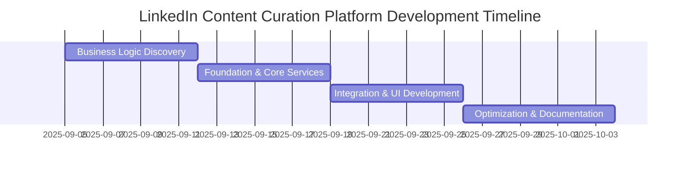
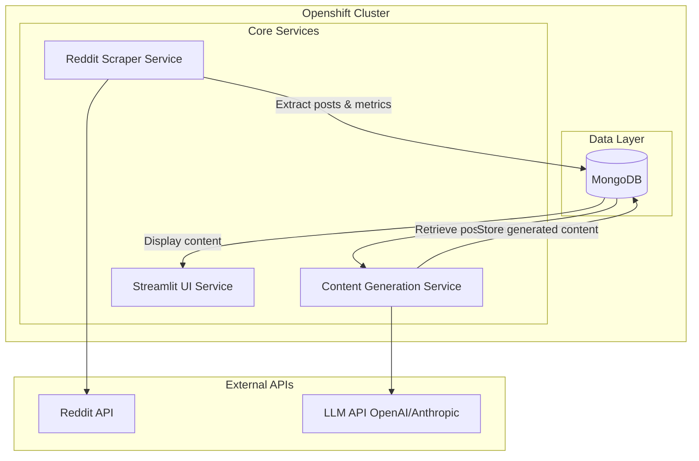
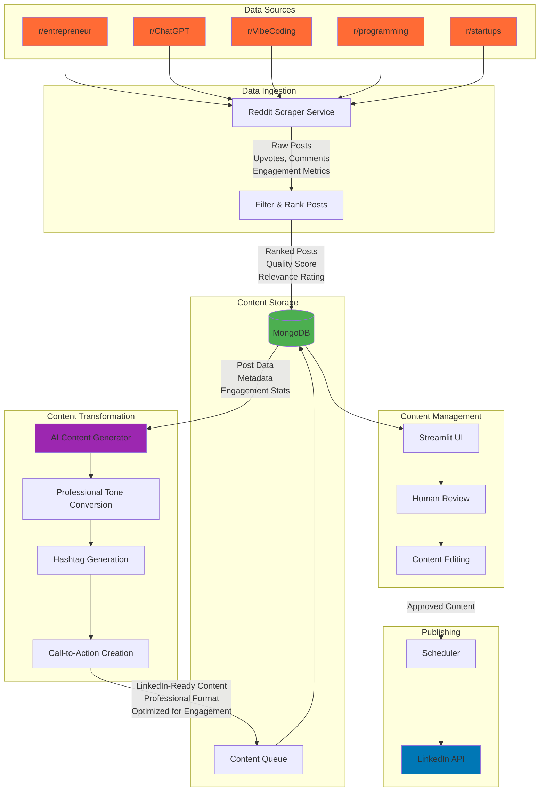

# CSE 7319 - Software Architecture & Design Project Proposal

**Project Option:** Option 1 - Microservices Architecture

## Project Title
**LinkedIn influencer: Automated Content Curation Platform**

## Project Overview

### 1. Main Functions

- **Automated Content Discovery**: Scrape multiple technology-focused subreddits (r/entrepreneur, r/ChatGPT, r/VibeCoding, r/programming, r/startups) to identify trending posts based on upvotes, comments, and engagement metrics
- **Intelligent Content Curation**: Filter and rank posts based on relevance, engagement potential, and professional appropriateness for LinkedIn audiences
- **AI-Powered Content Transformation**: Convert Reddit discussions and insights into professional LinkedIn post formats with proper tone, hashtags, and call-to-actions

### 2. Expected Results
- Consistent social media presence with 5-7 high-quality posts per week
- Aggregated insights on trending tech topics and successful LinkedIn content patterns
- Demonstrate scalable microservices architecture handling real-time data processing, AI integration, and multi-platform API interactions

### 3. Technology Stack & Architecture

**Initial Architecture (Monolithic Python Application)**
- **Primary Language**: Python
- **Database**: MongoDB (containerized within Openshift environment)
- **UI Framework**: Streamlit
- **Deployment**: Openshift cluster

**Core Services**
1. **Scraper Service**: Extracts top posts and engagement metrics from target subreddits, stores structured data in MongoDB
2. **Content Generation Service**: Retrieves post data from MongoDB, performs LLM API calls to transform content into LinkedIn-appropriate formats, stores generated content with source attribution
3. **UI Service**: Streamlit web application providing content review, editing, and publishing interface

**Future Extensibility**
- **LaTeX Compiler Service**: Generate PDF poster variants of curated content
- **Analytics Service**: Track post performance and engagement metrics
- **Scheduling Service**: Automated posting and content calendar management
- **Email Service**: Newsletter distribution and notifications using Redis-backed message queues for asynchronous processing

### 4. Project Timeline

**Project Duration**: September 5, 2025 - October 3, 2025 (4 weeks)



**Detailed Task Breakdown:**

**Week 1: Business Logic Discovery (Sept 5-11)**
- Manually browse target subreddits (r/entrepreneur, r/ChatGPT, r/VibeCoding, r/programming, r/startups)
- Document post selection criteria based on upvotes, comments, and engagement patterns
- Record the manual content transformation process from Reddit posts to LinkedIn format
- Analyze decision-making patterns for professional tone, hashtag selection, and call-to-action creation
- Define data schema requirements for posts, engagement metrics, and generated content
- Establish quality filters and relevance scoring criteria
- Create workflow documentation for automation reference

**Week 2: Foundation & Core Services (Sept 12-18)**
- Set up Openshift cluster environment and networking configuration
- Deploy MongoDB as StatefulSet with persistent storage
- Implement Reddit scraper service using PRAW library
- Create data extraction logic for post metadata, engagement metrics, and content
- Develop content generation service with LLM API integration (OpenAI/Anthropic)
- Design MongoDB collections and indexes for posts and generated content
- Implement content transformation algorithms based on documented manual patterns
- Create service-to-service communication interfaces

**Week 3: Integration & UI Development (Sept 19-25)**
- Build Streamlit web application with content review interface
- Develop post preview, editing, and approval workflows
- Integrate Reddit scraper with content generation pipeline
- Connect UI service to MongoDB for content retrieval and management
- Implement automated workflow replicating documented manual process
- Create content queue management and scheduling functionality
- Test end-to-end workflow from Reddit scraping to LinkedIn-ready content
- Validate automated results against manual baseline quality standards

**Week 4: Optimization & Documentation (Sept 26-Oct 3)**
- Conduct performance testing on all microservices under load
- Optimize database queries and API response times
- Refine content generation algorithms based on testing feedback
- Complete comprehensive project documentation including architecture decisions
- Document manual process findings and automation evolution
- Perform final integration testing across all services
- Prepare project presentation materials highlighting workflow transformation
- Conduct final quality assurance comparing automated vs manual content output

## Project Design

### 1. Primary Architecture Style

**Microservices Architecture** is the primary architectural approach for this project. This choice is driven by:

- **Service Independence**: Each service (scraper, content generation, UI) can be developed, deployed, and scaled independently
- **Technology Flexibility**: Future services (LaTeX compiler, email service) can use different technologies while maintaining loose coupling
- **Scalability**: Individual services can scale based on demand (e.g., scaling content generation during peak usage)
- **Fault Isolation**: Failure in one service doesn't cascade to others
- **Development Agility**: Supports the iterative approach of starting with manual processes and gradually automating

### 2. Architecture Diagrams


**Simplified Activity Flow**


**System Architecture**


**Detailed Activity Flow**


### 3. Prototype Screens


**Content Review & Edit Screen**
```
┌─────────────────────────────────────────────────────────┐
│ Post Editor                               [Back] [Save] │
├─────────────────────────────────────────────────────────┤
│ Original Reddit Post Preview:                           │
│ r/entrepreneur • 1.2k upvotes • 89 comments             │
│ "Just raised our Series A - here's what I learned..."   │
├─────────────────────────────────────────────────────────┤
│ Generated LinkedIn Post:                                │
│ ┌─────────────────────────────────────────────────────┐ │
│ │ 🚀 Key lessons from a successful Series A raise:    │ │
│ │                                                     │ │
│ │ • Timing is everything - market conditions matter   │ │
│ │ • Your team story sells as much as your product     │ │
│ │ • Due diligence prep can make or break the deal     │ │
│ │                                                     │ │
│ │ What's been your experience with fundraising?       │ │
│ │                                                     │ │
│ │ #Startups #Fundraising #Entrepreneurship            │ │
│ └─────────────────────────────────────────────────────┘ │
│ [🤖 Regenerate] [📅 Schedule for 2:00 PM] [📤 Post Now]│
└─────────────────────────────────────────────────────────┘
```

## Project Implementation Plan

### Platform & Tools
- **Primary Language**: Python 3.11+
- **Web Framework**: Streamlit (UI)
- **Database**: MongoDB with PyMongo driver
- **Container Platform**: Docker
- **Orchestration**: Openshift
- **APIs**: 
  - Reddit API (PRAW library)
  - OpenAI/Anthropic API for content generation
- **Development Tools**: 
  - Poetry for dependency management
  - pytest for testing
  - Black/Ruff for code formatting
  - mypy for type checking
  - GitHub Actions for CI/CD

### Deployment
- **Containerization**: Docker containers for each service
- **Orchestration**: Openshift cluster deployment
- **Database**: MongoDB deployed as StatefulSet in Openshift
- **Networking**: Service mesh for inter-service communication
- **Monitoring**: Basic logging and health checks

### Team Roles
**Individual Project** - All components will be developed by the project owner