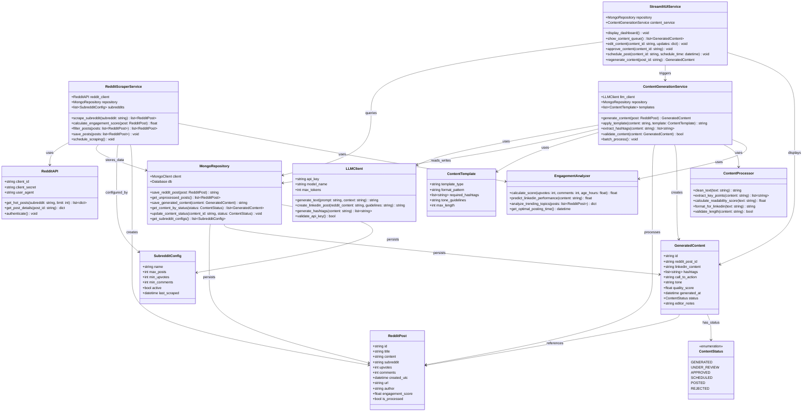

# Technical Implementation - Class Diagram

```mermaid
classDiagram
    %% Reddit Data Models
    class RedditPost {
        +string id
        +string title
        +string content
        +string subreddit
        +int upvotes
        +int comments
        +datetime created_utc
        +string url
        +string author
        +float engagement_score
        +bool is_processed
    }

    class SubredditConfig {
        +string name
        +int max_posts
        +int min_upvotes
        +int min_comments
        +bool active
        +datetime last_scraped
    }

    %% Content Generation Models
    class GeneratedContent {
        +string id
        +string reddit_post_id
        +string linkedin_content
        +list~string~ hashtags
        +string call_to_action
        +string tone
        +float quality_score
        +datetime generated_at
        +ContentStatus status
        +string editor_notes
    }

    class ContentTemplate {
        +string template_type
        +string format_pattern
        +list~string~ required_hashtags
        +string tone_guidelines
        +int max_length
    }

    %% Service Classes
    class RedditScraperService {
        +RedditAPI reddit_client
        +MongoRepository repository
        +list~SubredditConfig~ subreddits
        +scrape_subreddit(subreddit: string) list~RedditPost~
        +calculate_engagement_score(post: RedditPost) float
        +filter_posts(posts: list~RedditPost~) list~RedditPost~
        +save_posts(posts: list~RedditPost~) void
        +schedule_scraping() void
    }

    class ContentGenerationService {
        +LLMClient llm_client
        +MongoRepository repository
        +list~ContentTemplate~ templates
        +generate_content(post: RedditPost) GeneratedContent
        +apply_template(content: string, template: ContentTemplate) string
        +extract_hashtags(content: string) list~string~
        +validate_content(content: GeneratedContent) bool
        +batch_process() void
    }

    class StreamlitUIService {
        +MongoRepository repository
        +ContentGenerationService content_service
        +display_dashboard() void
        +show_content_queue() list~GeneratedContent~
        +edit_content(content_id: string, updates: dict) void
        +approve_content(content_id: string) void
        +schedule_post(content_id: string, schedule_time: datetime) void
        +regenerate_content(post_id: string) GeneratedContent
    }

    %% Repository Layer
    class MongoRepository {
        +MongoClient client
        +Database db
        +save_reddit_post(post: RedditPost) string
        +get_unprocessed_posts() list~RedditPost~
        +save_generated_content(content: GeneratedContent) string
        +get_content_by_status(status: ContentStatus) list~GeneratedContent~
        +update_content_status(content_id: string, status: ContentStatus) void
        +get_subreddit_configs() list~SubredditConfig~
    }

    %% External API Clients
    class RedditAPI {
        +string client_id
        +string client_secret
        +string user_agent
        +get_hot_posts(subreddit: string, limit: int) list~dict~
        +get_post_details(post_id: string) dict
        +authenticate() void
    }

    class LLMClient {
        +string api_key
        +string model_name
        +int max_tokens
        +generate_text(prompt: string, context: string) string
        +create_linkedin_post(reddit_content: string, guidelines: string) string
        +generate_hashtags(content: string) list~string~
        +validate_api_key() bool
    }

    %% Utility Classes
    class ContentProcessor {
        +clean_text(text: string) string
        +extract_key_points(content: string) list~string~
        +calculate_readability_score(text: string) float
        +format_for_linkedin(text: string) string
        +validate_length(content: string) bool
    }

    class EngagementAnalyzer {
        +calculate_score(upvotes: int, comments: int, age_hours: float) float
        +predict_linkedin_performance(content: string) float
        +analyze_trending_topics(posts: list~RedditPost~) dict
        +get_optimal_posting_time() datetime
    }

    %% Enums
    class ContentStatus {
        <<enumeration>>
        GENERATED
        UNDER_REVIEW
        APPROVED
        SCHEDULED
        POSTED
        REJECTED
    }

    %% Relationships
    RedditScraperService --> RedditAPI : uses
    RedditScraperService --> MongoRepository : stores_data
    RedditScraperService --> SubredditConfig : configured_by
    RedditScraperService --> RedditPost : creates

    ContentGenerationService --> LLMClient : uses
    ContentGenerationService --> MongoRepository : reads_writes
    ContentGenerationService --> ContentTemplate : uses
    ContentGenerationService --> RedditPost : processes
    ContentGenerationService --> GeneratedContent : creates
    ContentGenerationService --> ContentProcessor : uses

    StreamlitUIService --> MongoRepository : queries
    StreamlitUIService --> ContentGenerationService : triggers
    StreamlitUIService --> GeneratedContent : displays

    MongoRepository --> RedditPost : persists
    MongoRepository --> GeneratedContent : persists
    MongoRepository --> SubredditConfig : persists

    GeneratedContent --> RedditPost : references
    GeneratedContent --> ContentStatus : has_status

    ContentGenerationService --> EngagementAnalyzer : uses
    RedditScraperService --> EngagementAnalyzer : uses
```